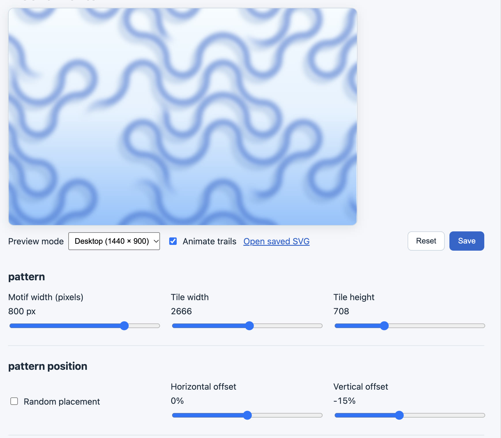

# moove-hektor

A hero banner generator for Moove, inspired by [Hektor by Jürg Lehni](https://juerglehni.com/works/hektor).
Built with Next.js, TypeScript, Tailwind CSS, and Zustand. Export self-contained
animated SVGs or save projects as JSON.



## Getting Started

Requires Node.js **20.9 or newer** and pnpm.

```sh
pnpm install
pnpm dev
```

Open [Studio](http://localhost:3000).

| Command | Description |
| --- | --- |
| `pnpm dev` | Run Studio locally |
| `pnpm build` | Build the static site in `out/` |
| `pnpm start` | Preview the built site |
| `pnpm lint` | Check source code |

Run `pnpm build` before `pnpm start`.

## Controls

| Control | Description |
| --- | --- |
| Preview mode | Desktop, Mobile crop, or Intersect viewport to inspect motifs around the desktop boundary |
| Animate trails | Toggle between animated trails and the complete static pattern in the preview |
| Open SVG | Open the current project as a standalone animated SVG |
| Motif width | Displayed motif width in pixels |
| Tile width / Tile height | Horizontal and vertical repeat spacing in native motif units |
| Random placement | Randomize the pattern offset |
| Horizontal offset / Vertical offset | Shift the entire pattern by a percentage of the tile |
| Selected motif | Choose the motif to edit |
| Add motif / Remove motif | Add a motif or remove the selected one |
| Invert motif | Rotate the selected motif by 180° |
| Horizontal position / Vertical position | Position the selected motif as a percentage of the tile |
| Trail color | Set the animated stroke color |
| Stroke width | Set stroke thickness in native motif units; blur and shadow distance scale with it |
| Blur | Set edge softness as a percentage of stroke width; 0% disables blur |
| Shadow | Add a shadow to the trails |
| Background gradient | Toggle the gradient; disabling it uses the top background color |
| Background top / Background middle / Background bottom | Set the three gradient colors; the top color also controls the solid background |
| Staggering | Start trails randomly, left-to-right by column, or top-to-bottom by row |
| Random starting positions | Randomize where drawing begins along each outline |
| Circuit duration | Seconds for one complete circuit |
| Drawing duration | Seconds spent drawing before the tail drains; applies when pause is greater than zero |
| Trail length | Visible trail length as a percentage of the outline |
| Pause between trails | Seconds to wait after the trail disappears; zero loops continuously |
| Head fade length / Tail fade length | Set each fade length in native motif units; zero disables that ramp |

## Projects

Changes are saved automatically in this browser. Use **Download JSON** to keep
or share a portable project.

- **Load JSON** reads a file into the draft without changing the preview.
- **Apply JSON** validates the draft and updates the project. **Cmd/Ctrl + Enter** also applies it.
- **Format** validates and formats the draft without applying it.
- **Download JSON** saves the applied project as `hektor-project.json`, excluding unapplied edits.
- **Revert edits** discards the draft and shows the current applied project JSON.
- **Restore defaults** resets the project, updates browser storage, and clears the draft.

Invalid JSON leaves the current project intact. Settings without a dedicated
control can be edited in the Project panel.

Edit `app/defaults.ts` to change the bundled defaults; saved projects keep their
settings until **Restore defaults** is used.

## SVG Export

Click **Download SVG** to save the applied project as `hektor.svg`, including its
animation runtime. Use an iframe to embed it in a hero banner:

```html
<iframe
  src="/hektor.svg"
  sandbox="allow-scripts"
  title="Decorative animated background"
  aria-hidden="true"
  tabindex="-1"
  style="width:100%;height:100%;border:0;pointer-events:none"
></iframe>
```

Size the containing element to fit your banner. An `` or CSS background does
not run the animation. If using CSP, allow the frame and the SVG's embedded script
and styles.

## Files

- `app/editor.tsx` contains Studio controls.
- `app/ui.tsx` contains shared Tailwind components.
- `app/preview.tsx` renders the SVG preview modes.
- `app/project-panel.tsx` handles JSON drafts, loading, and downloads.
- `app/project.ts` defines project types, validation, and serialization.
- `app/store.ts` contains persisted Zustand state.
- `app/defaults.ts` defines the bundled project defaults.
- `app/runtime.ts` contains geometry and animation.
- `app/svg.ts` generates SVG markup.
- `app/export.ts` assembles and downloads animated SVGs.
- `app/compile.ts` compiles the animation runtime for standalone SVG exports.
